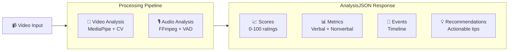
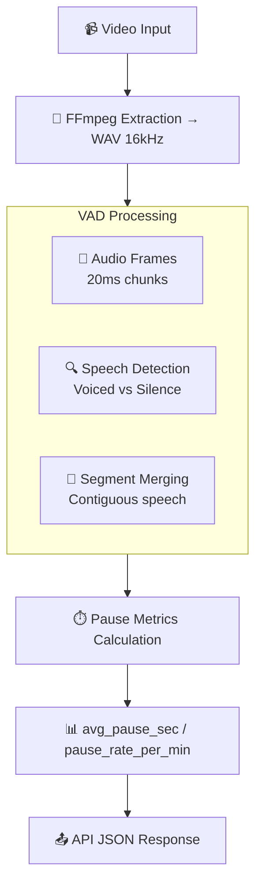

# 🎯 SpeechUp-IA: Oratory Analysis Backend

A FastAPI-powered backend that analyzes short videos to provide comprehensive feedback on public speaking performance, covering both nonverbal communication and speech patterns.

## 📖 Introduction

**SpeechUp-IA** is an intelligent oratory analysis system that processes short videos (typically 30 seconds to 5 minutes) and returns structured, actionable feedback. It's designed for public speakers, presenters, and anyone looking to improve their communication skills.

### 🎯 Purpose
The system analyzes two key aspects of communication:

- **Nonverbal Communication**: Gestures, gaze patterns, posture, facial expressions, and overall engagement
- **Verbal Communication**: Speech patterns, pauses, speaking rate, and vocal delivery

### 📤 Output
Every analysis returns a standardized JSON response (`AnalysisJSON`) containing:
- **Scores**: Numerical ratings (0-100) for fluency, clarity, pace, engagement, and delivery confidence
- **Metrics**: Detailed measurements for both verbal and nonverbal aspects
- **Events**: Timeline of detected gestures and key moments
- **Recommendations**: Personalized, actionable tips for improvement
- **Quality**: Analysis metadata and confidence indicators

### 🔄 High-Level System Overview



**ASCII Fallback:**
```
Video Input → [Video Analysis + Audio Analysis] → JSON Output
                ↓                    ↓
            MediaPipe CV        FFmpeg + VAD
                ↓                    ↓
            Nonverbal Metrics   Pause Metrics
                ↓                    ↓
            [Scores + Metrics + Events + Recommendations]
```

## 🛠️ Installation

### 1. Clone Repository
```bash
git clone <repository-url>
cd speechUp-IA
```

### 2. Create Virtual Environment
```bash
python -m venv .venv
```

### 3. Activate Virtual Environment

**Windows (PowerShell):**
```powershell
.\.venv\Scripts\Activate.ps1
```

**Windows (Command Prompt):**
```cmd
.\.venv\Scripts\activate.bat
```

**Linux/macOS:**
```bash
source .venv/bin/activate
```

### 4. Install Dependencies
```bash
pip install -r requirements.txt
```

### 5. Install FFmpeg (Required for Audio Analysis)

**Windows:**
```powershell
winget install --id=Gyan.FFmpeg -e
```

**macOS:**
```bash
brew install ffmpeg
```

**Linux (Ubuntu/Debian):**
```bash
sudo apt update
sudo apt install ffmpeg
```

**Verify Installation:**
```bash
ffmpeg -version
```

## ⚙️ Running the API

### Start API Without Audio Analysis
```bash
uvicorn api.main:app --reload
```

### Start API With Audio Analysis Enabled
```bash
# Windows PowerShell
$env:SPEECHUP_USE_AUDIO=1
uvicorn api.main:app --reload

# Linux/macOS
export SPEECHUP_USE_AUDIO=1
uvicorn api.main:app --reload
```

### Start API With ASR Transcription Enabled
```bash
# Windows PowerShell
$env:SPEECHUP_USE_AUDIO=1
$env:SPEECHUP_USE_ASR=1
uvicorn api.main:app --reload

# Linux/macOS
export SPEECHUP_USE_AUDIO=1
export SPEECHUP_USE_ASR=1
uvicorn api.main:app --reload
```

**Note**: ASR requires audio to be enabled (`SPEECHUP_USE_AUDIO=1`).

### Start API With Prosody Analysis Enabled
```bash
# Windows PowerShell
$env:SPEECHUP_USE_AUDIO=1
$env:SPEECHUP_USE_PROSODY=1
uvicorn api.main:app --reload

# Linux/macOS
export SPEECHUP_USE_AUDIO=1
export SPEECHUP_USE_PROSODY=1
uvicorn api.main:app --reload
```

**Note**: Prosody analysis requires audio to be enabled (`SPEECHUP_USE_AUDIO=1`).

### 🎯 ASR Performance & Setup
- **Model Download**: First run downloads Whisper model to `~/.cache/whisper/`
- **Auto-Model Selection**: Automatically selects optimal model based on device (GPU: `small`, CPU: `base`)
- **Model Override**: Use `SPEECHUP_ASR_MODEL` to override auto-selection
- **Timeout Protection**: 25-second hard limit prevents hanging on long audio files

The API will be available at `http://localhost:8000`

#### **Whisper Model Selection Guide**

| Model | Size | Speed | Accuracy | Use Case |
|-------|------|-------|----------|----------|
| `tiny` | 39 MB | ⚡⚡⚡ | ⭐⭐ | Fast prototyping, low accuracy needs |
| `base` | 74 MB | ⚡⚡ | ⭐⭐⭐ | **CPU default**, balanced performance |
| `small` | 244 MB | ⚡ | ⭐⭐⭐⭐ | **GPU default**, high accuracy |
| `medium` | 769 MB | 🐌 | ⭐⭐⭐⭐⭐ | Maximum accuracy, slower processing |
| `large` | 1550 MB | 🐌🐌 | ⭐⭐⭐⭐⭐ | Best accuracy, slowest processing |

**Performance Tips:**
- **CPU Usage**: `base` model provides optimal speed/accuracy balance
- **GPU Usage**: `small` model offers excellent accuracy with reasonable speed
- **High Accuracy**: Use `medium` or `large` for critical applications
- **WPM Smoothing**: Automatically applied for videos ≥20s using 3-point moving average

**STT Confidence Metrics:**
- **Real Whisper Probabilities**: `stt_confidence` is computed from actual Whisper decoder probabilities, not heuristics
- **Confidence Components**: Combines `avg_logprob` (decoder confidence) and `no_speech_prob` (speech detection)
- **Segment-Level Analysis**: Confidence computed across all valid speech segments
- **Normalized Scale**: Output normalized to [0.0, 1.0] range for easy interpretation

**Privacy & Logging:**
- **Transcript Privacy**: Full transcript is not logged by default; only `transcript_short` (first 200 chars) appears in DEBUG logs
- **Data Retention**: No transcript data is stored persistently; only processed metrics are returned

**Note:**
- ASR processes up to the first 20s of audio for performance. You can increase this via the `SPEECHUP_ASR_MAX_WINDOW_SEC` environment variable.
- Set `SPEECHUP_DEBUG_ASR=1` to enable detailed ASR debug logging (device, model, transcript snippet, errors).
- Override device selection with `WHISPER_DEVICE=cpu|cuda|mps` if needed.

### 🏷️ Labels & Feedback System

**Labels and Feedback** provide human-friendly insights based on quantitative analysis results, making the API responses more accessible and actionable.

### **Labels Generated**
The system automatically generates 0-5 descriptive labels based on:

- **Speaking Rate**: "ritmo lento", "ritmo adecuado", "ritmo acelerado"
- **Filler Words**: "pocas muletillas", "muchas muletillas"
- **Pause Patterns**: "pausas regulares", "pausas caóticas", "pausas largas"
- **Prosody**: "entonación plana", "entonación expresiva", "bajo contraste de energía", "buen contraste de energía"
- **Gestures**: "pocos gestos", "gestualidad activa"

### **Recommendations Structure**
Each recommendation includes:
- **area**: Categorization (comunicación, voz, presencia)
- **tip**: Specific, actionable advice in Spanish (es-AR)

### **Example Output**
```json
"labels": ["ritmo adecuado", "pocas muletillas", "pausas regulares", "entonación expresiva"],
"recommendations": [
  {"area": "comunicación", "tip": "Buen ritmo: claro y fácil de seguir."},
  {"area": "voz", "tip": "Variá la entonación en palabras clave (subí 2–3 semitonos)."}
]
```

## 🎵 Prosody Analysis (MVP)

**Prosody** analyzes the musical aspects of speech including pitch, energy, and rhythm patterns. This feature is gated by the `SPEECHUP_USE_PROSODY` environment variable.

#### **Enable Prosody Analysis**
```bash
# Windows PowerShell
$env:SPEECHUP_USE_AUDIO=1
$env:SPEECHUP_USE_PROSODY=1
uvicorn api.main:app --reload

# Linux/macOS
export SPEECHUP_USE_AUDIO=1
export SPEECHUP_USE_PROSODY=1
uvicorn api.main:app --reload
```

#### **Prosody Metrics**

| Metric | Description | Range | Computation |
|--------|-------------|-------|-------------|
| `pitch_mean_hz` | Average fundamental frequency (F0) in Hz | 0+ Hz | Mean of voiced frames using librosa.pyin |
| `pitch_range_semitones` | Pitch variation range in semitones | 0+ st | 12 × log2(f0/median) range across voiced frames |
| `pitch_cv` | Pitch coefficient of variation | [0, 1] | Standard deviation / mean of voiced F0 values |
| `energy_cv` | Energy coefficient of variation | [0, 1] | RMS energy variation across audio frames |
| `rhythm_consistency` | Speech rhythm regularity | [0, 1] | 1 - CV of inter-onset intervals from VAD segments |

#### **Technical Details**
- **Audio Format**: Uses 16kHz mono WAV extracted by `video/audio_utils.py`
- **Pitch Tracking**: Robust F0 estimation with `librosa.pyin` (75-400 Hz range)
- **Error Handling**: Graceful fallback to zeros if computation fails
- **Performance**: Minimal latency impact when enabled
- **Dependencies**: Requires `librosa` and `numpy`

#### **Prosody-Based Recommendations**
The system automatically generates prosody-specific tips:
- **Low pitch variation** (< 2 semitones): Suggests adding tonal emphasis
- **Low energy dynamics** (< 0.1 CV): Recommends volume variation
- **Poor rhythm consistency** (< 0.4): Advises practicing phrase timing

### 🔄 Integration Flow

```mermaid
flowchart TD
    A[👤 User uploads video<br/>to /v1/feedback-oratoria] --> B[⚙️ Pipeline.py runs<br/>Video + (optional Audio)]
    B --> C[📊 Metrics + Events<br/>normalized]
    C --> D[✅ Pydantic Validation<br/>AnalysisJSON]
    D --> E[📤 Final API JSON Response<br/>with Scores + Recommendations]
    
    subgraph B ["Pipeline Execution"]
        F[🎥 Video Analysis<br/>MediaPipe Models]
        G[🎙️ Audio Analysis<br/>FFmpeg + VAD]
    end
    
    subgraph C ["Data Processing"]
        H[📈 Nonverbal Metrics<br/>0-1 normalized]
        I[⏱️ Verbal Metrics<br/>Pause analysis]
        J[✋ Gesture Events<br/>Timeline]
    end
```

**ASCII Fallback:**
```
User Upload → Pipeline.py → Metrics Normalization → Pydantic Validation → Final Response
                ↓                    ↓                      ↓
            Video+Audio         Nonverbal+Verbal      AnalysisJSON Schema
                ↓                    ↓                      ↓
            MediaPipe+FFmpeg    Normalized [0-1]      Scores+Recommendations
```

## 🎥 Video Analysis

### Core Technology
SpeechUp uses **MediaPipe** (Google's computer vision library) to analyze video frames at approximately **10 FPS** for optimal performance:

- **MediaPipe Holistic**: Detects body pose, hand positions, and facial landmarks
- **MediaPipe FaceMesh**: Provides detailed facial expression analysis with 468 landmark points
- **MediaPipe Face Detection**: Ensures face visibility and positioning

### Nonverbal Metrics Implemented

#### **Gaze & Attention**
- `gaze_screen_pct`: Percentage of time looking at the camera (0-1)
- `head_stability`: Head movement consistency (0-1, higher = more stable)

#### **Posture & Presence**
- `posture_openness`: Shoulder span and body openness (0-1)
- `face_coverage_pct`: Percentage of frames where face is visible

#### **Gestures & Movement**
- `gesture_rate_per_min`: Number of hand gestures per minute
- `gesture_amplitude`: Average magnitude of hand movements (0-1)
- `gesture_events`: Timeline of detected gesture moments

#### **Expression & Engagement**
- `expression_variability`: Facial expression changes over time (0-1)
- `engagement`: Combined score from gestures and posture (0-1)

### 🔄 Video Pipeline Flow

```mermaid
flowchart TD
    A[📹 Video Input] --> B[🔄 Frame Sampling ~10 fps]
    B --> C[🤖 MediaPipe Holistic + FaceMesh]
    C --> D[📊 Nonverbal Metrics Extraction]
    D --> E[🎯 Engagement Calculation]
    E --> F[✋ Gesture Events Timeline]
    F --> G[📏 Normalized Metrics (0-1)]
    G --> H[📤 API JSON Response]
    
    subgraph D ["Metrics Extracted"]
        I[👁️ Gaze & Head Stability]
        J[🧍 Posture Openness]
        K[✋ Gesture Rate & Amplitude]
        L[😊 Expression Variability]
    end
```

**ASCII Fallback:**
```
Video Input → Frame Sampling → MediaPipe Models → Metrics → Events → Normalized Output → API Response
                ↓                    ↓              ↓         ↓         ↓
            ~10 fps           Holistic+FaceMesh  Gaze/Posture  Timeline   [0-1] range
```

### 🚀 Recent Improvements

- **Warm-up Period**: Eliminates spurious events in the first 0.5 seconds
- **Gesture Debouncing**: Ensures gestures are detected ≥2 seconds apart
- **Metric Normalization**: All metrics are clamped to [0,1] range
- **Engagement Scoring**: Scaled to 0-100 in final scores

## 🎙️ Audio Analysis (MVP)

### Activation
Audio analysis is **disabled by default** and must be explicitly enabled with the `SPEECHUP_USE_AUDIO=1` environment variable.

### Processing Pipeline
1. **Audio Extraction**: Uses FFmpeg to convert video to mono 16kHz WAV format
2. **Voice Activity Detection**: WebRTC VAD identifies speech vs. silence segments
3. **Pause Analysis**: Computes gaps between speech segments

### Metrics Computed
- `avg_pause_sec`: Average duration of pauses between speech segments
- `pause_rate_per_min`: Number of pauses per minute of speech

### ASR Integration (Optional)
When `SPEECHUP_USE_ASR=1` is enabled, the system also provides:
- **Transcription**: Full text transcript of speech content
- **WPM (Words Per Minute)**: Speaking rate calculation
- **Filler Word Detection**: Spanish filler word identification and counting
- **Enhanced Recommendations**: Verbal communication tips based on ASR analysis

### 🔄 Audio Pipeline Flow (MVP)



**ASCII Fallback:**
```
Video Input → FFmpeg → WAV 16kHz → WebRTC VAD → Speech Segments → Pause Metrics → API Response
                ↓           ↓           ↓              ↓               ↓
            Audio Extract  Mono 16kHz  Voice Detection  Gap Analysis   Pause Stats
```

### Fallback Behavior
If audio analysis is disabled or FFmpeg is unavailable:
- `audio_available` is set to `false`
- All verbal metrics default to 0.0
- API continues to function normally with video-only analysis

## 📊 JSON Response Structure

### Complete Response Schema
```json
{
  "scores": {
    "fluency": 75,
    "clarity": 82,
    "pace": 68,
    "engagement": 79,
    "delivery_confidence": 85
  },
  "verbal": {
    "wpm": 0.0,
    "articulation_rate_sps": 0.0,
    "fillers_per_min": 0.0,
    "avg_pause_sec": 0.45,
    "pause_rate_per_min": 12.3,
    "pronunciation_score": 0.0,
    "stt_confidence": 0.0
  },
  "nonverbal": {
    "face_coverage_pct": 0.98,
    "gaze_screen_pct": 0.87,
    "head_stability": 0.92,
    "posture_openness": 0.76,
    "gesture_rate_per_min": 8.5,
    "gesture_amplitude": 0.68,
    "expression_variability": 0.73,
    "engagement": 0.79
  },
  "events": [
    {
      "t": 2.1,
      "kind": "gesture",
      "label": null,
      "duration": null
    }
  ],
  "recommendations": [
    {
      "area": "comunicación",
      "tip": "Mirá a cámara más seguido para sostener la conexión."
    },
    {
      "area": "presencia",
      "tip": "Aumentá un poco la amplitud de los gestos para enfatizar ideas."
    }
  ],
  "labels": [
    "ritmo adecuado",
    "pocas muletillas",
    "pausas regulares",
    "entonación expresiva"
  ],
  "quality": {
    "frames_analyzed": 150,
    "frames_dropped": 0,
    "audio_available": true
  }
}
```

### Key Response Sections

#### **Scores (0-100)**
- **fluency**: Overall speaking smoothness
- **clarity**: Speech intelligibility and articulation
- **pace**: Speaking speed appropriateness
- **engagement**: Nonverbal communication effectiveness
- **delivery_confidence**: Overall presentation confidence

#### **Verbal Metrics**
- **avg_pause_sec**: Average pause duration (seconds)
- **pause_rate_per_min**: Pauses per minute of speech
- **wpm**: Words per minute (computed from ASR when enabled, with smoothing for videos ≥20s)
- **fillers_per_min**: Filler words per minute (computed from ASR when enabled)
- **filler_counts**: Breakdown of specific filler words detected
- **stt_confidence**: Speech-to-text confidence score (0.0-1.0) based on Whisper decoder probabilities
- **transcript_short**: First 200 characters of transcript (when ASR enabled)
- **pronunciation_score**: Placeholder for future enhancement

#### **Nonverbal Metrics (0-1)**
- **gaze_screen_pct**: Camera eye contact percentage
- **posture_openness**: Body openness and presence
- **gesture_amplitude**: Hand movement magnitude
- **engagement**: Combined nonverbal effectiveness

#### **Events**
- **t**: Timestamp in seconds
- **kind**: Event type (currently "gesture")
- **label**: Event description (future enhancement)
- **duration**: Event length (future enhancement)

#### **Labels & Recommendations**
- **Labels**: Human-friendly descriptors (0-5 labels) that summarize key characteristics
- **Recommendations**: Structured tips with area categorization (3-6 recommendations)
- Mix of positive reinforcement and constructive improvement suggestions
- Based on detected metrics and thresholds
- Currently in Spanish (es-AR) with Argentine Spanish expressions

#### **Quality**
- **frames_analyzed**: Total frames processed
- **frames_dropped**: Skipped frames (if any)
- **audio_available**: Audio processing success flag

## ✅ Current Status

### ✅ Implemented & Stable
- **Video Analysis**: Full nonverbal metric pipeline with MediaPipe
- **Audio MVP**: Basic pause detection and analysis
- **API Schema**: Fully consistent Pydantic validation
- **Backward Compatibility**: No breaking changes to existing endpoints
- **Error Handling**: Graceful fallbacks for missing dependencies

### 🔧 Recent Fixes
- Pydantic validation errors resolved
- Engagement metric properly propagated
- Audio availability flag correctly set
- All scores returned as integers (0-100)

## 🚀 Next Steps & Roadmap

### **Short Term (Next 2-4 weeks)**
- **✅ Whisper Integration**: Speech-to-text transcription (COMPLETED)
- **✅ Word-per-Minute**: Calculate actual speaking rate with smoothing for videos ≥20s (COMPLETED)
- **✅ Enhanced Filler Detection**: Expanded Spanish fillers with accent normalization (COMPLETED)
- **✅ Transcript Short**: First 200 characters of transcript for privacy-conscious logging (COMPLETED)
- **Pronunciation Analysis**: Phoneme-level speech quality assessment

### **Medium Term (1-2 months)**
- **Pronunciation Metrics**: Phoneme-level analysis
- **Prosody Analysis**: Pitch, energy, and rhythm patterns
- **Emotion Detection**: Sentiment analysis from voice and face

### **Long Term (3+ months)**
- **Multi-language Support**: Spanish, English, and more
- **Real-time Streaming**: WebSocket-based live analysis
- **Advanced ML Models**: Custom-trained models for specific domains

## 🧪 Testing

### Run All Tests
```bash
# Activate virtual environment first
.\.venv\Scripts\Activate.ps1

# Run tests
pytest
```

### Run Specific Test Categories
```bash
# Video analysis tests
pytest tests/test_video_pipeline.py

# API endpoint tests
pytest tests/test_api.py

# Audio processing tests
pytest tests/test_audio.py
```

## 🔧 Configuration

### Environment Variables
- `SPEECHUP_USE_AUDIO`: Enable audio analysis (default: "1")
- `SPEECHUP_USE_ASR`: Enable ASR transcription (default: "1")
- `SPEECHUP_USE_PROSODY`: Enable prosody analysis (default: "1")
- `SPEECHUP_ASR_MODEL`: Whisper model size (default: "base", options: "tiny", "base", "small", "medium", "large")
- `SPEECHUP_DEBUG_ASR`: Enable ASR debug logging (default: "0")
- `SPEECHUP_INCLUDE_TRANSCRIPT`: Include full transcript in response (default: "0")
- `SPEECHUP_TRANSCRIPT_PREVIEW_MAX`: Max preview length (default: "1200")
- `SPEECHUP_MAX_EVENTS`: Maximum events to return (default: "100")
- `SPEECHUP_GESTURE_MIN_AMP`: Minimum gesture amplitude (default: "0.25")
- `SPEECHUP_GESTURE_MIN_DUR`: Minimum gesture duration (default: "0.10")
- `SPEECHUP_GESTURE_COOLDOWN`: Gesture cooldown period (default: "0.35")
- `SPEECHUP_GESTURE_REQUIRE_FACE`: Require face for gesture detection (default: "1")
- `MEDIAPIPE_USE_GPU`: Force GPU acceleration (default: "1")
- `LOG_LEVEL`: Logging verbosity (default: "INFO")

### MediaPipe Settings
- **Model Complexity**: Configurable (0=light, 1=full, 2=heavy)
- **Detection Confidence**: Minimum confidence thresholds
- **Tracking Confidence**: Minimum tracking thresholds

## 📚 API Documentation

Once the server is running, visit:
- **Interactive API Docs**: `http://localhost:8000/docs`
- **ReDoc Documentation**: `http://localhost:8000/redoc`
- **OpenAPI Schema**: `http://localhost:8000/openapi.json`

## 🤝 Contributing

### Development Setup
1. Fork the repository
2. Create a feature branch
3. Make your changes
4. Add/update tests
5. Ensure all tests pass
6. Submit a pull request

### Code Style
- Follow PEP 8 guidelines
- Use type hints where possible
- Add docstrings to new functions
- Run pre-commit hooks before committing

## 📄 License

[Add your license information here]

## 🆘 Support

### Common Issues
- **FFmpeg not found**: Ensure FFmpeg is installed and in PATH
- **MediaPipe errors**: Check GPU drivers and CUDA installation
- **Memory issues**: Reduce video resolution or frame rate

### Getting Help
- Check existing issues on GitHub
- Create a new issue with detailed error information
- Include video sample and system specifications

---

**SpeechUp-IA** - Making better speakers, one video at a time! 🎤✨
